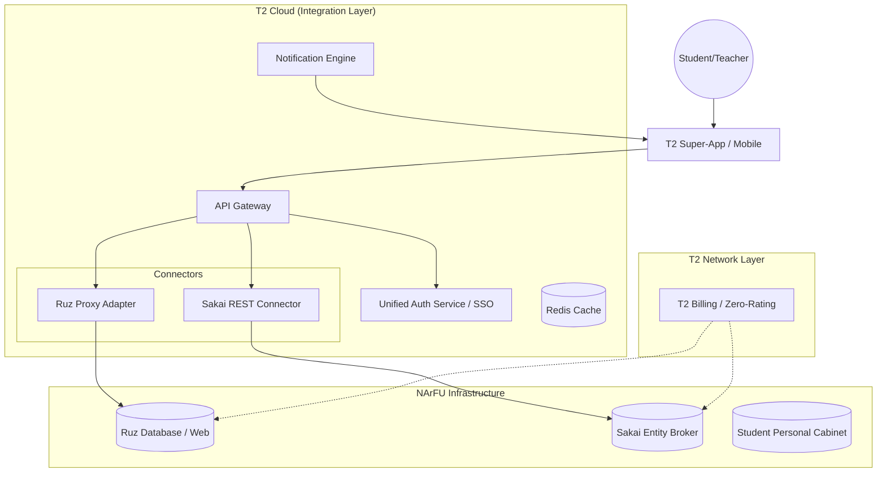

# Software Architecture: T2-NArFU Integrated Ecosystem

## 1. System Overview
The system is designed as a **Microservices-based Middleware** architecture that bridges the gap between legacy university services (Ruz, Sakai) and the T2 Mobile Super-App. The core philosophy is "Unified Data, Zero Friction."

### High-Level Diagram (Mermaid)

---

## 2. Component Description

### 2.1 T2 Super-App (Frontend)
*   **Tech Stack:** React Native or Flutter (for cross-platform performance).
*   **Modules:**
    *   **Dashboard:** High-level overview (Today's classes, next deadline, mobile balance).
    *   **Smart Timetable:** Interactive schedule with deep links to courses.
    *   **Sakai View:** WebView-based or Native UI for assignments and materials.
    *   **Profile:** Digital student ID and tariff management.

### 2.2 T2 Integration Gateway (Backend)
*   **Tech Stack:** Node.js (NestJS) or Go (for high concurrency).
*   **Ruz Proxy Adapter:** Since NArFU Ruz lacks a modern public API, this service performs structured scraping and caching. It detects changes by comparing the `last_updated` timestamp and triggers notifications.
*   **Sakai REST Connector:** Communicates with Sakai's Entity Broker via JSON. It maps university course IDs to T2 user profiles.
*   **Notification Engine:** A worker service that monitors schedule changes and new Sakai announcements. It pushes alerts via Firebase (FCM) or Apple (APNs).

### 2.3 Unified Auth Service (SSO)
*   **Protocol:** OpenID Connect (OIDC) or LTI 1.3.
*   **Logic:** The student logs in once using their T2 credentials (phone number + SMS/Bio). The service maps this to the university's LDAP/AD credentials, enabling "one-click" access to Sakai without re-authentication.

---

## 3. Key Data Flows

### 3.1 Schedule Synchronization & Change Detection
1.  **Gateway** polls Ruz every 15 minutes for each active group.
2.  If the hash of the schedule or `last_updated` field changes:
    *   Compare the old and new JSON.
    *   Identify specific changes (Room change, Teacher replacement).
    *   **Notification Engine** sends a targeted push: *"Alert: Your 3rd lesson (ML) moved to Room 42."*
3.  **App** updates the local SQLite/Room database.

### 3.2 "One-Click" Sakai Access
1.  User clicks "View Materials" on a specific lesson in the App.
2.  **App** requests a signed SSO token from the **Auth Service**.
3.  **App** opens an In-App Browser (Safari View Controller / Chrome Custom Tabs) with the URL: `https://sakai.narfu.ru/portal/site/{id}?auth_token={token}`.
4.  Sakai validates the token and logs the user in automatically.

---

## 4. Zero-Rating Implementation (Network Level)
To provide "Unlimited Educational Traffic":
*   **T2 PCRF (Policy and Charging Rules Function):** Configured to identify traffic to `*.narfu.ru` and the Integration Gateway IPs.
*   **Deep Packet Inspection (DPI):** Ensures that only educational traffic is free, preventing data leaks to other services within the same session.

---

## 5. Security & Performance
*   **Caching:** Redis is used to store Ruz schedule data to prevent overloading the university's legacy servers.
*   **Encryption:** All traffic is strictly TLS 1.3.
*   **Rate Limiting:** Protects university infrastructure from excessive polling.

## 6. Technology Stack Summary
*   **Mobile:** Flutter (Dart).
*   **Backend:** Node.js (TypeScript) + NestJS.
*   **Database:** PostgreSQL (User data) + Redis (Cache).
*   **Infrastructure:** Kubernetes (Docker) on T2 Cloud.
*   **Integrations:** REST (Sakai), HTML/JSON Proxy (Ruz), LTI 1.3 (Auth).
